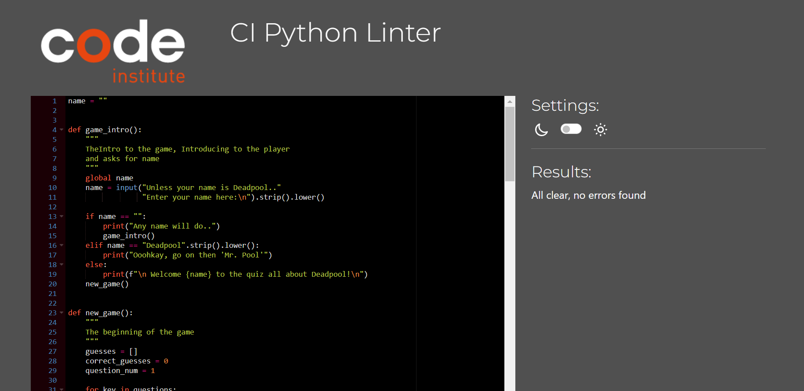

# The Deadpool Python Quiz
- This is a quiz within the Terminal inspired by the comic/ character: Deadpool.
- The purpose of this activity was to make a fun and simple quiz. 
- For fans and/or newbies that would like to test their knowledge about the character Deadpool. 

The live website can be viewed through Heroku using this link: 
- [View The Deadpool Quiz Here](https://deadpool-python-quiz.herokuapp.com/)

- [GitHub Repository](https://github.com/snoad96/deadpool-python-quiz)

## Contents

-    The Ideas
-    How to play
-    Features
-    Future features
-    Testing
    -    bugs
        -    Resolved Bugs
        -    Remaining Bugs
-   Deployment
-   Credits

## The Ideas

The initial Idea was to make an RPG inspired game through Python, this took some time to make and was a while into the progress, but realised there was too much planned in the time-frame to do this.

Instead changed over to a quiz style instead, this idea was brought about because everyone should enjoy the comic book genre, specifically Deadpool if they saw how complex of a character he is.

The rough planning was there about how to do this, compared to having limited ideas on the original RPG story telling game.
This made it easier to start and also made writing the correct code a little bit easier in the beginning.
I already had some questions and answers lined up, which would fit perfectly into what I wanted to do for this challenge.

## How To Play
-   The Idea of the quiz is quite simple and because I was limited with design features, compared to the previous projects with HTML and CSS. The way to play is very easy to understand and is also explained at the start of the game.

    The user has multiple choice answers to questions revolving around deadpool.
    Each time the user makes a choice, they will be informed everytime they input a possible answer.
    At the end of the quiz, the game will then tell the user how well they did.
    
 ## Features

-   Because this was a project specifically done within Python, I had used the template given to me for assessment and have not added any HTML or CSS, it is strictly Python that I have used.

-   I have added a feature where the user is able to add their name at the start of the game, the idea is to make it more user friendly and feel more familiar to the user.

-   A fun feature that is implemented into this challenge is the score total out of 100% 
    
    

-    I like this percentage feature as it makes it easier for me to add to it or change the quiz around later on.

## Future features
- Future features that would be interesing to implement would be;
    - A google sheet to save names and scores of users to improve playability.
    - A Timer for each question to add a bit off stress and captivity for the user.
    - Make the project have more intresting styles, colors etc.. I was limited with what I could do in this project.

##  Testing
This project has been tested using Code Institutes own [pep8 Python Linter](https://pep8ci.herokuapp.com/)

No errors were found during testing.

### bugs
-    Resolved Bugs
    -   I had a few issues with Deploying the play_again feature,
        The game would constantly exit after playing once, even after writing the loop to be able to use the play again feature.
        this took me a while to find the bug. But was easily rectified after speaking to my mentor and using stack overflow to problem solve.
        I just had to rewrite some of the code within the play_again().
    -   I could control what happened when the user pressed space but had trouble defining what would happen when the user tried a different invalid key.
        I had got the majority of the code correct, but after a meeting with my mentor and being guided towards the right answer, I had figured out I had to rewrite some of it and basically add it to any place where the user could potentially press an invalid key.

-   There are no known bugs remaining.

## Deployment
### To Heroku
1. Make sure to fork or clone your repository.
2. Go to [Heroku](https://id.heroku.com/login)
3. Create a new app.
4. Choose your apps name and create.
5. Install buildpacks, 
    - Choose Python and Node.js, in that order.
6. On the 'Deploy' section, Connect to GitHub and search for you repository.
7. Choose branch and deploy! You will have the option to redeploy automatically or manually.

## Credits

- I would like to thank the slack community for their help and advice throughout this part of the course.
- StackOverflow, for general questions and queries in regards to what I had planned for this challenge.
- My mentor Spence, for making sure I stay within what is required for the project and not with my original plan. 
  For guiding me to the right answers when I have been unsure where to look